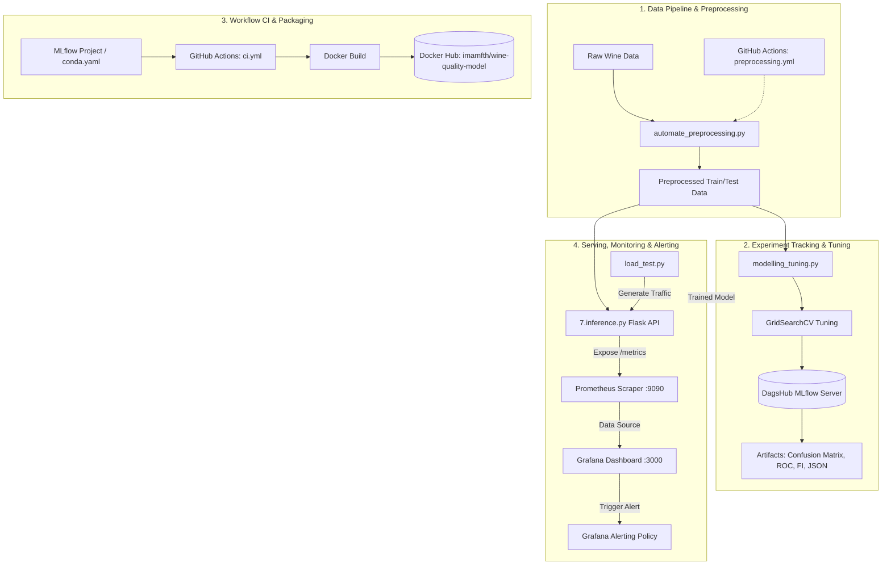

# 🍷 Wine Quality MLOps End-to-End System

[](https://www.python.org/)
[](https://github.com/Imamabdulfatah/eksperimen-sml-wine-mlops/actions)
[](https://dagshub.com/imamabdul8875/wine-quality-mlops.mlflow)
[](https://dagshub.com/imamabdul8875/wine-quality-mlops)
[](https://hub.docker.com/r/imamfth/wine-quality-model)
[](https://prometheus.io/)
[](https://grafana.com/)

---

## 📖 Ringkasan Proyek

Proyek ini adalah implementasi lengkap siklus hidup **Machine Learning Operations (MLOps)** untuk kasus klasifikasi biner kualitas anggur (*Wine Quality Classification*) berbasis data fisikokimia dari **UCI Machine Learning Repository**.

Sistem ini mengintegrasikan seluruh tahapan MLOps modern:
1. **Data Preprocessing & Otomasi CI**: Pembersihan data, rekayasa fitur, EDA komprehensif, dan otomatisasi preprocessing via GitHub Actions.
2. **Model Training & Experiment Tracking**: Hyperparameter tuning (GridSearchCV) pada Random Forest Classifier yang terintegrasi secara *remote* dengan **DagsHub MLflow Tracking Server**.
3. **Continuous Integration (CI) & Containerization**: Standarisasi packaging model via **MLflow Project**, otomatisasi build image, dan deployment container ke **Docker Hub** via GitHub Actions.
4. **Model Serving & Observability**: REST API inferensi menggunakan **Flask**, pemantauan metrik *real-time* menggunakan **Prometheus** (12 custom metrics), serta visualisasi interaktif dan sistem **Alerting** pada **Grafana**.

---

## 🏛️ Arsitektur Sistem MLOps



---

## 📂 Struktur Direktori Proyek

```text
proyek ml-ops/
├── .github/
│   └── workflows/
│       ├── preprocessing.yml                # CI: Otomasi Preprocessing saat raw data update
│       └── ci.yml                           # CI: Model Training, Packaging & Push Docker Hub
├── .gitignore                               # File ignore Git untuk cache dan temp files
├── README.md                                # Dokumentasi lengkap proyek
├── Template_Eksperimen_MSML.ipynb           # Template acuan eksperimen
│
├── Eksperimen_SML_Imam-Abdul-Fatah/         # MODUL 1: Eksperimen & Preprocessing Data
│   ├── .github/workflows/
│   │   └── preprocessing.yml                # Workflow preprocessing lokal modul
│   ├── preprocessing/
│   │   ├── Eksperimen_Imam-Abdul-Fatah.ipynb# Notebook EDA & Eksperimen lengkap
│   │   ├── automate_Imam-Abdul-Fatah.py     # Skrip otomatisasi preprocessing data
│   │   └── winequality_preprocessing/       # Dataset hasil preprocessing
│   │       ├── train_data.csv
│   │       ├── test_data.csv
│   │       └── winequality_preprocessed.csv
│   ├── winequality_raw/                     # Dataset mentah dari UCI ML
│   │   ├── winequality-red.csv              # 1.599 sampel red wine
│   │   └── winequality-white.csv            # 4.898 sampel white wine
│   └── requirements.txt
│
├── Membangun_model/                         # MODUL 2: Training & Remote MLflow Tracking
│   ├── DagsHub.txt                          # Tautan DagsHub, Run ID, & instruksi eksekusi
│   ├── modelling.py                         # Training dasar (Autolog lokal)
│   ├── modelling_tuning.py                  # Training tuning + DagsHub Remote Tracking
│   ├── winequality_preprocessing/           # Dataset input training
│   └── requirements.txt
│
├── Workflow-CI/                             # MODUL 3: MLflow Project & CI Docker Hub
│   ├── .github/workflows/
│   │   └── ci.yml                           # Workflow CI modul
│   └── MLProject/
│       ├── MLProject                        # File definisi standar MLflow Project
│       ├── conda.yaml                       # Spesifikasi conda environment
│       ├── docker_hub_link.txt              # Informasi tautan repository Docker Hub
│       ├── modelling.py                     # Entry point pelatihan model untuk MLflow
│       └── winequality_preprocessing/
│
└── Monitoring dan Logging/                  # MODUL 4: Serving, Prometheus & Grafana
    ├── 1.bukti_serving/                     # Folder bukti screenshot request/response API
    ├── 2.prometheus.yml                     # Konfigurasi scraping Prometheus
    ├── 3.prometheus_exporter.py             # Definisi 12 custom metrics Prometheus
    ├── 4.bukti_monitoring_Prometheus/       # Folder bukti screenshot target & PromQL
    ├── 5.bukti_monitoring_Grafana/          # Folder bukti screenshot dashboard visualisasi
    ├── 6.bukti_alerting_Grafana/            # Folder bukti screenshot konfigurasi Alert Rule
    ├── 7.inference.py                       # REST API Flask untuk Model Serving
    ├── Dockerfile                           # Dockerfile untuk containerisasi API
    ├── docker-compose.yml                   # Orkestrasi multi-container (API, Prom, Grafana)
    ├── load_test.py                         # Skrip simulasi request beban trafik
    └── requirements.txt
```

---

## 🛠️ Rincian Modul & Hasil Implementasi

### 📌 MODUL 1: Eksperimen SML & Preprocessing Otomatis
* **Folder:** `Eksperimen_SML_Imam-Abdul-Fatah/`
* **Tahapan Data Preprocessing:**
  1. **Penggabungan Data:** Menggabungkan dataset *Red Wine* (1.599 baris) dan *White Wine* (4.898 baris) menjadi 6.497 baris dengan penambahan fitur kategorikal `wine_type`.
  2. **Pembersihan Duplikat & Missing Values:** Identifikasi dan penanganan data duplikat serta verifikasi kelengkapan nilai data.
  3. **Penanganan Outlier:** Menerapkan metode *Interquartile Range (IQR) Capping* pada fitur numerik untuk menjaga distribusi tanpa menghilangkan informasi.
  4. **Encoding & Standarisasi:** Encoding target `quality` menjadi biner (*Low Quality* $\le 5$ dan *High Quality* $\ge 6$) serta penskalaan fitur menggunakan `StandardScaler`.
  5. **Train-Test Split:** Pemisahan dataset menjadi 80% Data Latih (4.256 sampel) dan 20% Data Uji (1.064 sampel).
* **Otomasi CI (`preprocessing.yml`):** Dijalankan otomatis oleh GitHub Actions setiap kali ada perubahan pada data mentah di `winequality_raw/` atau skrip `automate_Imam-Abdul-Fatah.py`.

---

### 📌 MODUL 2: Membangun Model & Tracking MLflow (DagsHub)
* **Folder:** `Membangun_model/`
* **Algoritma:** Random Forest Classifier dengan **GridSearchCV** (5-Fold Cross Validation).
* **Hyperparameter Terbaik:**
  ```json
  {
    "n_estimators": 200,
    "max_depth": 20,
    "min_samples_split": 2,
    "min_samples_leaf": 1,
    "max_features": "sqrt"
  }
  ```
* **Hasil Evaluasi Model:**
  | Metrik Evaluasi | Skor / Nilai |
  |---|---|
  | **Accuracy** | `76.50%` |
  | **Precision** | `79.38%` |
  | **Recall** | `84.38%` |
  | **F1-Score** | `81.80%` |
  | **ROC-AUC Score** | `0.8353` |
  | **Best CV F1-Score** | `82.07%` |
* **Integrasi Remote DagsHub MLflow:**
  - **Tracking Server:** [https://dagshub.com/imamabdul8875/wine-quality-mlops.mlflow](https://dagshub.com/imamabdul8875/wine-quality-mlops.mlflow)
  - **Run ID:** `7fea84dea2b344278a8743b8b65da903`
  - **Artefak Tersimpan:**
    - `confusion_matrix.png`
    - `roc_curve.png`
    - `feature_importance.png`
    - `classification_report.json`
    - `model/` (Scikit-Learn MLmodel binary)

---

### 📌 MODUL 3: Workflow CI (GitHub Actions & Docker Hub)
* **Folder:** `Workflow-CI/`
* **Standardisasi MLflow Project:** File `MLProject` dan `conda.yaml` mengisolasi environment pelatihan model secara reproducible.
* **Pipeline Otomatisasi GitHub Actions (`ci.yml`):**
  1. Trigger otomatis setiap push ke branch `main` pada direktori `Workflow-CI/MLProject/**` atau via `workflow_dispatch`.
  2. Setup environment Python 3.10 & Miniconda.
  3. Menjalankan `mlflow run . --env-manager=local`.
  4. Build Docker image model via MLflow models containerizer.
  5. Login dan push otomatis image ke **Docker Hub**.
* **Repository Docker Hub:**
  - **Link Image:** [https://hub.docker.com/r/imamfth/wine-quality-model](https://hub.docker.com/r/imamfth/wine-quality-model)
  - **Tag:** `latest` dan commit SHA.

---

### 📌 MODUL 4: Model Serving, Prometheus Monitoring & Grafana Alerting
* **Folder:** `Monitoring dan Logging/`
* **Komponen & Layanan:**
  1. **REST API (`7.inference.py`):** Framework Flask yang mendukung multi-format payload JSON input (array `features` maupun direct key-value dictionary) dan terintegrasi dengan prometheus exporter.
  2. **12 Custom Metrics Prometheus (`3.prometheus_exporter.py`):**
     - `prediction_requests_total` (Counter total request prediksi per status)
     - `prediction_latency_seconds` (Histogram waktu respon inferensi)
     - `prediction_errors_total` (Counter error per tipe)
     - `active_requests` (Gauge request yang sedang aktif)
     - `model_prediction_class_total` (Counter distribusi kelas 0/1)
     - `prediction_confidence_score` (Histogram probabilitas prediksi)
     - `system_cpu_usage_percent` (Gauge penggunaan CPU server)
     - `system_memory_usage_bytes` (Gauge penggunaan RAM server)
     - `system_disk_usage_percent` (Gauge penggunaan Disk server)
     - `request_payload_size_bytes` (Histogram ukuran byte payload)
     - `high_confidence_predictions_total` (Counter prediksi dengan confidence > 85%)
     - `model_load_time_seconds` (Gauge durasi loading model)
  3. **Prometheus Scraping (`2.prometheus.yml`):** Scraping endpoint `http://localhost:5000/metrics` setiap interval 5 detik.
  4. **Grafana Dashboard & Alerting:** Visualisasi panel metrik time-series dan konfigurasi alert rule (memicu notifikasi saat P95 latency $> 500\text{ ms}$).
  5. **Load Testing (`load_test.py`):** Skrip generator trafik untuk memicu variasi request dan fluktuasi metrik pada grafik monitoring.

---

## 📡 Dokumentasi Spesifikasi API

### 1. Health Check
* **Endpoint:** `GET /health`
* **Response `200 OK`:**
  ```json
  {
    "model_loaded": true,
    "status": "healthy"
  }
  ```

### 2. Predict Wine Quality
* **Endpoint:** `POST /predict`
* **Header:** `Content-Type: application/json`
* **Request Body (Format 1 - Objek Fitur Langsung):**
  ```json
  {
    "fixed acidity": 7.4,
    "volatile acidity": 0.70,
    "citric acid": 0.00,
    "residual sugar": 1.9,
    "chlorides": 0.076,
    "free sulfur dioxide": 11.0,
    "total sulfur dioxide": 34.0,
    "density": 0.9978,
    "pH": 3.51,
    "sulphates": 0.56,
    "alcohol": 9.4,
    "wine_type": "red"
  }
  ```
* **Request Body (Format 2 - Array Features):**
  ```json
  {
    "features": [7.4, 0.70, 0.00, 1.9, 0.076, 11.0, 34.0, 0.9978, 3.51, 0.56, 9.4, 0]
  }
  ```
* **Response Body `200 OK`:**
  ```json
  {
    "status": "success",
    "count": 1,
    "results": [
      {
        "prediction": 1,
        "label": "High Quality",
        "confidence": 0.8742
      }
    ],
    "latency_ms": 14.20
  }
  ```

### 3. Prometheus Metrics Endpoint
* **Endpoint:** `GET /metrics`
* **Response `200 OK`:** Raw Prometheus exposition format stream.

---

## 🚀 Panduan Menjalankan Sistem

### A. Menjalankan Model Serving & Load Test
```powershell
# 1. Jalankan API Server
cd "Monitoring dan Logging"
python 7.inference.py

# 2. Jalankan Simulasi Beban Trafik (di terminal baru)
python load_test.py
```

### B. Menjalankan Prometheus (Standalone Windows)
```powershell
cd "C:\Users\admin\Downloads\prometheus-3.14.0-rc.0.windows-amd64\prometheus-3.14.0-rc.0.windows-amd64"
.\prometheus.exe --config.file="2.prometheus.yml"
```
Akses UI Prometheus di: **[http://localhost:9090](http://localhost:9090)**

### C. Menjalankan Grafana
Jalankan `grafana-server.exe` atau service Grafana, lalu buka: **[http://localhost:3000](http://localhost:3000)** *(User/Pass: admin/admin)*.

---

## 🔗 Tautan Resmi Proyek

* 🐙 **GitHub Repository:** [https://github.com/Imamabdulfatah/eksperimen-sml-wine-mlops](https://github.com/Imamabdulfatah/eksperimen-sml-wine-mlops)
* 🧪 **DagsHub MLflow Server:** [https://dagshub.com/imamabdul8875/wine-quality-mlops](https://dagshub.com/imamabdul8875/wine-quality-mlops)
* 🐳 **Docker Hub Repository:** [https://hub.docker.com/r/imamfth/wine-quality-model](https://hub.docker.com/r/imamfth/wine-quality-model)

---

**Author:** Imam Abdul Fatah  
**Program:** Belajar Membangun Sistem Machine Learning (MSML) / MLOps Submission
